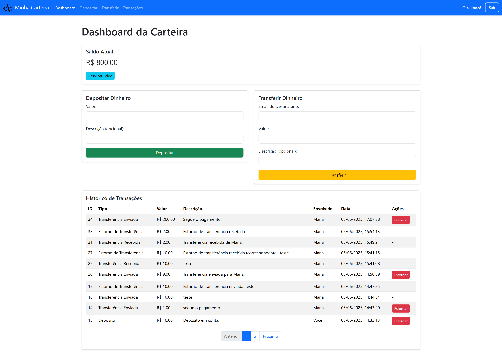
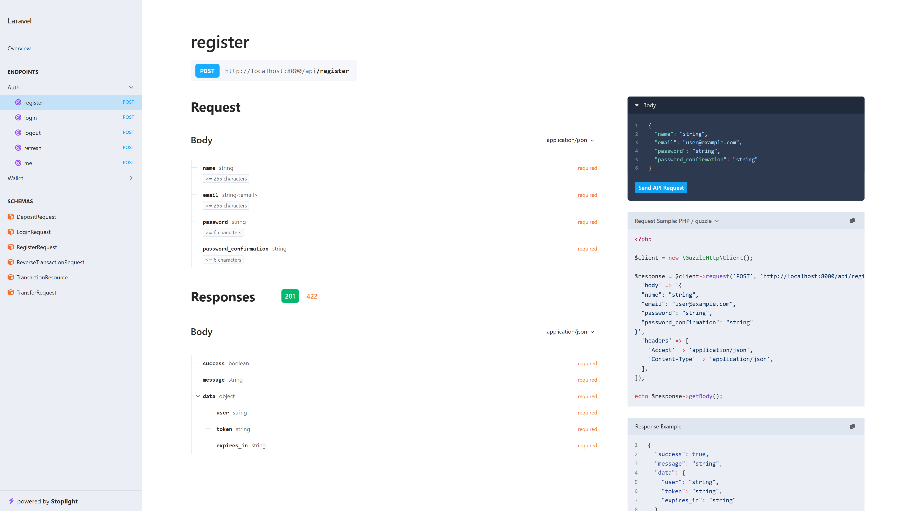

# 🚀 Projeto Carteira Financeira

Este projeto entrega uma interface funcional equivalente a uma carteira financeira, permitindo que usuários realizem cadastro, autenticação, depósitos, transferências e estornos de saldo. Desenvolvido com Laravel 12, ele demonstra a implementação de um backend robusto com frontend em Blade e Bootstrap 5.

## 📸 Capturas de Tela da Aplicação

Tela de Login


Dashboard da Carteira


## 💻 Tecnologias Utilizadas

Este projeto foi construído com as seguintes tecnologias e ferramentas:

Backend:

-   PHP 8.2+ 🐘: A linguagem de programação central.
-   Laravel 12.x 🍃: O framework PHP robusto e elegante.
-   MySQL / SQLite 🗄️: Sistema de banco de dados (configurável; SQLite em memória para testes).
-   tymon/jwt-auth 🔑: Pacote para autenticação JWT.
-   PEST 🧪: Um framework de testes com sintaxe expressiva e agradável.

Frontend:

-   Blade Templates 🔪: O poderoso sistema de templates do Laravel para renderização HTML.
-   Bootstrap 5.3 🌐: Um popular framework CSS para design responsivo e componentes de interface.
-   jQuery 3.7 ✨: Uma biblioteca JavaScript rápida, pequena e rica em recursos para manipulação do DOM e requisições AJAX.

Ferramentas de Desenvolvimento:

-   Composer 📦: Gerenciador de dependências PHP.
-   Artisan CLI ⚙️: A interface de linha de comando do Laravel.
-   Scramble 📝: Ferramenta de documentação OpenAPI/Swagger, gerada automaticamente a partir do código.

## 🛠️ Padrões de Desenvolvimento e Arquitetura

O projeto foi arquitetado para ser robusto, escalável e de fácil manutenção, seguindo princípios de Clean Architecture e SOLID. A estrutura de camadas garante a separação de responsabilidades e a testabilidade do código:

-   Controllers 🎬: Interagem com as requisições HTTP, delegando a lógica de negócio para os Services e formatando as respostas, mantendo-se "magros".
-   Services 💼: Contêm a lógica de negócio principal, orquestrando operações e lançando exceções de negócio específicas.
-   Repositories 🗃️: Abstraem o acesso a dados, interagindo com as Models e implementando interfaces para desacoplamento. (repository pattern)
-   DTOs 📦: Garantem a transferência de dados de forma tipada e estruturada entre as camadas.
-   Requests 📝: Centralizam a validação de dados de entrada da API.
-   Enums 🏷️: Proporcionam clareza e segurança de tipo para dados categorizados, como tipos de transação.
-   API Resources 📊: Padronizam e formatam as respostas JSON da API.

-   Tratamento Centralizado de Exceções 🚨: Todas as exceções são manipuladas globalmente, retornando \* \* respostas JSON consistentes e eliminando try-catch dos controllers.
-   Transações de Banco de Dados 🔄: Garantem a atomicidade e consistência das operações financeiras.

## 🚀 Como Rodar o Projeto

Siga os passos abaixo para configurar e executar o projeto em sua máquina local.

Pré-requisitos

-   PHP 8.2+
-   Composer
-   Um servidor web (Apache, Nginx ou o servidor embutido do PHP)
-   MySQL (para banco de dados) e SQLite para testes em memória (para testes)

### Passo 1: Clonar o Repositório

```bash
git clone https://github.com/marcelosiqqueira/gac-test
cd gac-test
```

```bash
git clone https://github.com/marcelosiqqueira/gac-test
cd gac-test
```

### Passo 2: Instalar Dependências do Composer

```bash
composer install
```

### Passo 3: Configurar o Ambiente

Crie o arquivo .env a partir do exemplo:

```bash
cp .env.example .env
```

Edite o arquivo .env e configure as credenciais do seu banco de dados

APP_NAME="Minha Carteira Financeira"

APP_URL="http://localhost:8000"

APP_DEBUG=true

DB_CONNECTION=mysql # ou sqlite

DB_HOST=127.0.0.1

DB_PORT=3306

DB_DATABASE=gac_test_db

DB_USERNAME=root

DB_PASSWORD=

### Passo 4: Gerar Chaves de Aplicação e JWT

```bash
php artisan key:generate
php artisan jwt:secret
```

### Passo 5: Configurar e Rodar Migrações do Banco de Dados

```bash
php artisan migrate
```

### Passo 6: Iniciar o Servidor de Desenvolvimento

```bash
php artisan serve
```

## 📚 Documentação da API (Scramble)

Este projeto utiliza Scramble para gerar e manter a documentação da API em formato OpenAPI/Swagger, automaticamente a partir do código-fonte. Isso garante que a documentação esteja sempre atualizada com os endpoints e modelos de dados da sua API.

Como Acessar a Documentação
Com o servidor de desenvolvimento em execução (php artisan serve), acesse a seguinte URL no seu navegador:

http://localhost:8000/docs/api



## 🧪 Rodando os Testes

Este projeto inclui testes de feature/integração usando PEST para garantir a funcionalidade dos endpoints da API.

Observação:
Para que os testes que utilizam SQLite em memória funcionem corretamente, a extensão pdo_sqlite do PHP deve estar habilitada. Caso contrário, você pode encontrar erros de "could not find driver".

```bash
php artisan test
```
